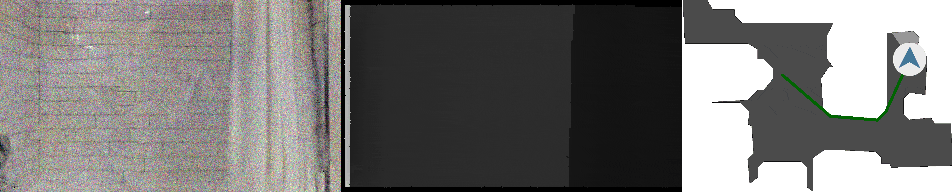

[](https://opensource.org/licenses/Apache-2.0)

<h1 align="center">Multi-modal Vision Transformers<br/>For Data Efficient Visual Odometry In Embodied Indoor Navigation</h1>
<p align="center"><b>Supplementary code repository to the Masters thesis by Marius Memmel</b></p>

<p align="center"></p>

<p align="center">
  
</p>
<p align="center">Visualization of an agent using the Visual Odometry Transformer (VOT) as GPS+compass substitute.<br/> Backbone is a ViT-B with MultiMAE pre-training and depth input.</p>


## Table of Contents

- [Setup](#setup)
- [Training](#training)
- [Evaluation](#evaluation)
- [Visualizations](#visualizations)
- [Privileged Information](#modality)
- [Privileged Information Examples](#modalityexamples)
- [References](#references)


## Setup <a name="setup"></a>

### Docker

This repository provides a [Dockerfile](Dockerfile) that can be used to setup an environment for running the code. It install the corresponding versions of [habitat-lab](https://github.com/facebookresearch/habitat-lab) and [habitat-sim](https://github.com/facebookresearch/habitat-sim), [habitat-sim](https://github.com/facebookresearch/habitat-sim), [timm](https://github.com/rwightman/pytorch-image-models/), and their dependencies. Note that for running the code at least one GPU supporting cuda 11.0 is required.

### Download Data

This repository requires two datasets to train and evaluate the VOT models:
1. [Gibson scene dataset](https://github.com/StanfordVL/GibsonEnv/blob/f474d9e/README.md#database)
2. [PointGoal Navigation splits](https://github.com/facebookresearch/habitat-lab/blob/d0db1b5/README.md#task-datasets), specifically `pointnav_gibson_v2.zip`.

Please follow [Habitat's instruction](https://github.com/facebookresearch/habitat-lab/blob/d0db1b5/README.md#task-datasets) to download them. The following datastructure is assumed under `./dataset`:
```
.
+-- dataset
|  +-- Gibson
|  |  +-- gibson
|  |  |  +-- Adrian.glb
|  |  |  +-- Adrian.navmesh
|  |  |  ...
|  +-- habitat_datasets
|  |  +-- pointnav
|  |  |  +-- gibson
|  |  |  |  +-- v2
|  |  |  |  |  +-- train
|  |  |  |  |  +-- val
|  |  |  |  |  +-- valmini
```

### Generate Dataset

This repository provides a script to generate the proposed training and validation datasets.
Run
```./generate_data.sh```
and specify the following arguments to generate the dataset. A dataset of 250k samples takes approx. **120GB**.
| Argument            | Usage                                                        |
| :------------------ | :----------------------------------------------------------- |
| `--act_type`        | Type of actions to be saved, `-1` for saving all actions     |
| `--N_list`          | Sizes for train and validation dataset. Thesis uses `250000` and `25000` |
| `--name_list`       | Names for train and validation dataset, default is `train` and `val` |

When generating the data, habitat-sim sometimes causes a **"isNvidiaGpuReadable(eglDevId) [EGL] EGL device 0, CUDA device 0 is not readable"** error. To fix it follow this [issue](https://github.com/facebookresearch/habitat-lab/issues/303#issuecomment-846072649). Overwrite ```habitat-sim/src/esp/gfx/WindowlessContext.cpp``` by the provided ```WindowlessContext.cpp```. 

### Pre-trained MultiMAE

Download the pre-trained [MultiMAE](https://github.com/EPFL-VILAB/MultiMAE) checkpoint from [this link](https://github.com/EPFL-VILAB/MultiMAE/releases/download/pretrained-weights/multimae-b_98_rgb+-depth-semseg_1600e_multivit-afff3f8c.pth), rename the model checkpoint to `MultiMAE-B-1600.pth` and place it in `./pretrained`.

### Pre-trained RL Policy

Download the pre-trained RL navigation policy checkpoint from [PointNav-VO](https://github.com/Xiaoming-Zhao/PointNav-VO) download the pretrained checkpoint of the RL navigation policy [this link](https://drive.google.com/drive/folders/1tkkuHMPgZW5-Gmsop7RGvTIslcvEVAj4) and place `rl_tune_vo.pth` under `pretrained_ckpts/rl/no_tune.pth`.


## Training
To train a VOT model, first specify the experiment configuration in a yaml file similar to [here](./config/vo/example_vo.yaml).
Then run

```./start_vo.sh --config-yaml PATH/TO/CONFIG/FILE.yaml```

## Evaluation
To evaluate a trained VOT model, first specify the evaluation configuarion in a yaml file similar to [here](./config/rl/example_rl.yaml).
Then run

```./start_rl.sh --run-type eval --config-yaml PATH/TO/CONFIG/FILE.yaml```

Note that passing ```--run-type train``` fine-tunes the navigation policy to the VOT model. This thesis does not make use of this functionality.

## Visualizations
To visualize agent behavior, the evaluation configuration has a ```VIDEO_OPTION``` [here](./config/rl/example_rl.yaml) that renders videos directly to a logging platform or disk.

To visualize attention maps conditioned on the action, refer to the [visualize_attention_maps](./visualize_attention_maps.ipynb) notebook that provides functionality to plot all attention heads of a trained VOT.

## Privileged Information <a name="modality"></a>
To run modality ablations and privileged information experiments, define the modality in the evaluation configuration as `VO.REGRESS.visual_strip=["rgb"]` or `VO.REGRESS.visual_strip=["depth"]`. Set `VO.REGRESS.visual_strip_proba=1.0` to define the probability of deactivating the input modality.

## Privileged Information Examples <a name="modalityexamples"></a>
Visualization of an agent using the Visual Odometry Transformer (VOT) as GPS+compass substitute. Backbone is a ViT-B with MultiMAE pre-training and RGB-D input. The scene is from them evaluation split of the Gibson4+ dataset. All agents navigate close to the goal even though important modalities are not available.
<p align="center">
  Training: RGBD, Test: RGBD
  
</p>

<p align="center">
  Training: Training: RGBD, Test: Depth, <b>RGB dropped 50% of the time</b>
  
</p>

<p align="center">
  Training: Training: RGBD, Test: RGB, <b>Depth dropped 50% of the time</b>
  
</p>

<p align="center">
  Training: Training: RGBD, Test: RGB, <b>Depth dropped 100% of the time</b>
  
</p>

<p align="center">
  Training: Training: RGBD, Test: Depth, <b>RGB dropped 100% of the time</b>
  
</p>

## References
This repository is a fork of [PointNav-VO](https://github.com/Xiaoming-Zhao/PointNav-VO) by [Xiaoming Xiao](https://xiaoming-zhao.com/). Please refer to the code and the thesis for changes made to the original repository.
